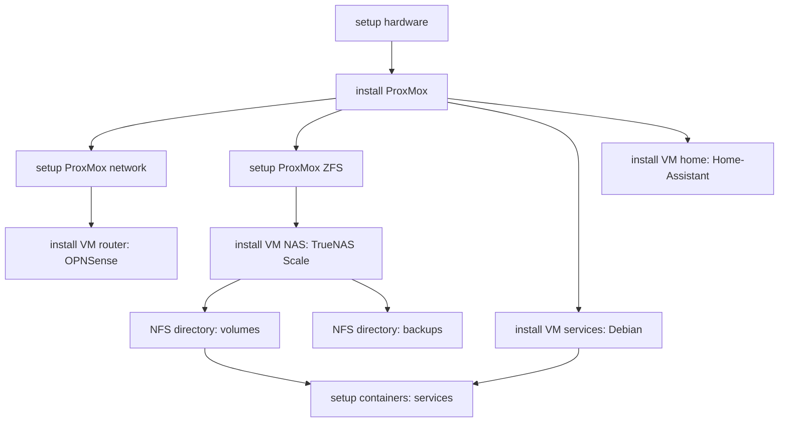

# Installation

work in progress installation order to prevent dependence conflicts

## dependency notes

- containers on docker machine `depends on NAS`
- VM network config `depends on Router VM`

## installation order

1. hardware
2. ProxMox
   1. setup
      - network
      - drives
   2. VMs
      1. Router VM
      2. NAS VM
         - NFS
         - directory for Docker volumes
         - directory for backups
      3. Docker VM
      4. Home VM
3. Go Live

## notes

## order

docker (volume) location: edit daemon.json file

